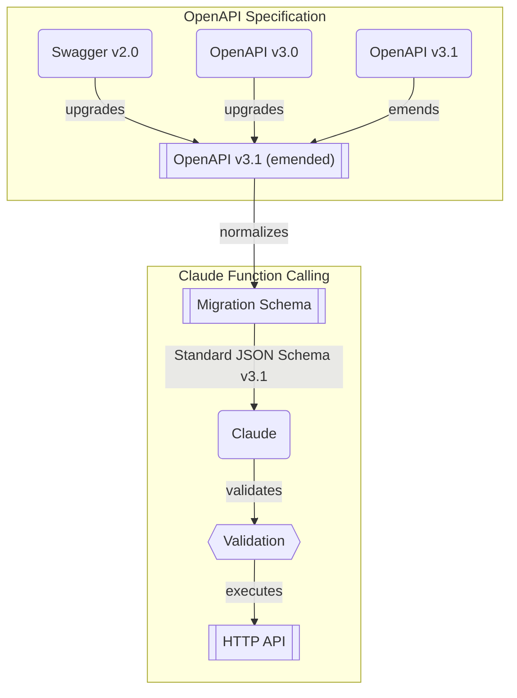

# `@samchon/openapi` for Claude


[](https://github.com/samchon/openapi/blob/master/LICENSE)
[](https://www.npmjs.com/package/@samchon/openapi)
[](https://www.npmjs.com/package/@samchon/openapi)
[](https://github.com/samchon/openapi/actions?query=workflow%3Abuild)
[](https://samchon.github.io/openapi/api/)
[](https://discord.gg/E94XhzrUCZ)

OpenAPI to Claude function calling composer with standard JSON Schema support.

`@samchon/openapi` supports Anthropic Claude's function calling through standard OpenAPI v3.1 JSON Schema specification. Unlike other LLM providers that use custom schema formats, Claude follows the standard JSON Schema specification, making it highly compatible with existing OpenAPI documents.

## Installation
```bash
npm install @samchon/openapi
```

## Usage
```typescript
import {
  HttpLlm,
  IHttpLlmApplication,
  IHttpLlmFunction,
  OpenApi,
} from "@samchon/openapi";

// Convert OpenAPI document
const document: OpenApi.IDocument = OpenApi.convert(swagger);

// Create Claude application
const application: IHttpLlmApplication<"claude"> = HttpLlm.application({
  model: "claude",
  document,
});

// Use with Anthropic SDK
const func: IHttpLlmFunction<"claude"> = application.functions[0];
const completion = await anthropic.messages.create({
  model: "claude-3-5-sonnet-latest",
  tools: [{
    name: func.name,
    description: func.description,
    input_schema: func.parameters,
  }],
  // ...
});
```

## Features

### Standard JSON Schema
Claude supports OpenAPI v3.1 standard JSON Schema specification:

```typescript
const schema: IClaudeSchema = {
  type: "object",
  properties: {
    title: { 
      type: "string", 
      description: "Title of the content" 
    },
    tags: { 
      type: "array", 
      items: { type: "string" }
    }
  },
  required: ["title"],
  additionalProperties: false
};
```

### Validation
Built-in parameter validation with detailed error messages:

```typescript
const validation = func.validate(input);
if (!validation.success) {
  console.log("Validation errors:", validation.errors);
}
```

### Parameter Separation
Separate LLM parameters from human-provided data:

```typescript
const application: IHttpLlmApplication<"claude"> = HttpLlm.application({
  model: "claude",
  document,
  options: {
    separate: (schema) =>
      ClaudeTypeChecker.isString(schema) &&
      !!schema.contentMediaType?.startsWith("image"),
  },
});
```

## API References
- [`HttpLlm.application()`](https://samchon.github.io/openapi/api/functions/HttpLlm.application.html): Create Claude function calling application
- [`IHttpLlmApplication<"claude">`](https://samchon.github.io/openapi/api/interfaces/IHttpLlmApplication-1.html): Claude application interface
- [`IHttpLlmFunction<"claude">`](https://samchon.github.io/openapi/api/interfaces/IHttpLlmFunction-1.html): Claude function interface  
- [`IClaudeSchema`](https://samchon.github.io/openapi/api/types/IClaudeSchema-1.html): Claude JSON Schema type
- [`ClaudeTypeChecker`](https://github.com/samchon/openapi/blob/master/src/utils/ClaudeTypeChecker.ts): Claude schema type checking utilities