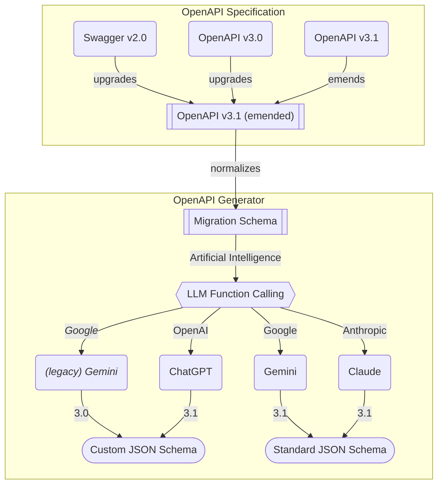
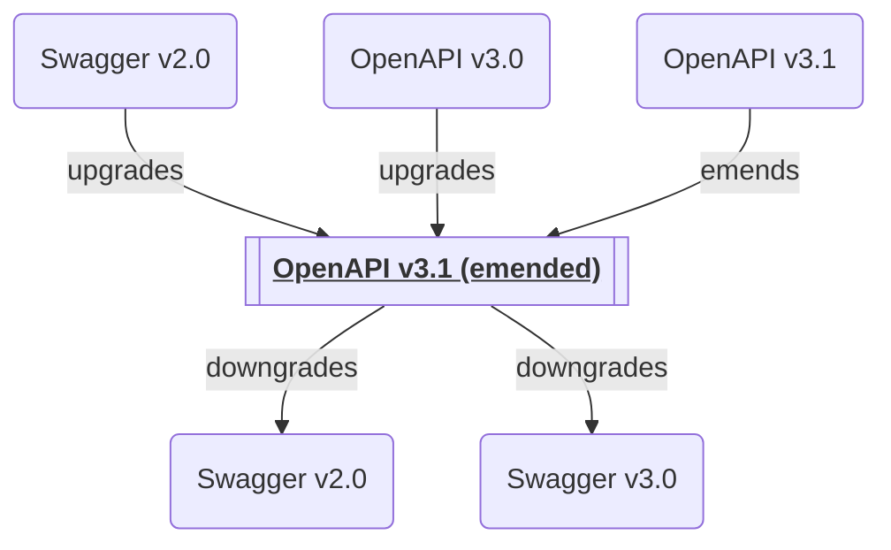
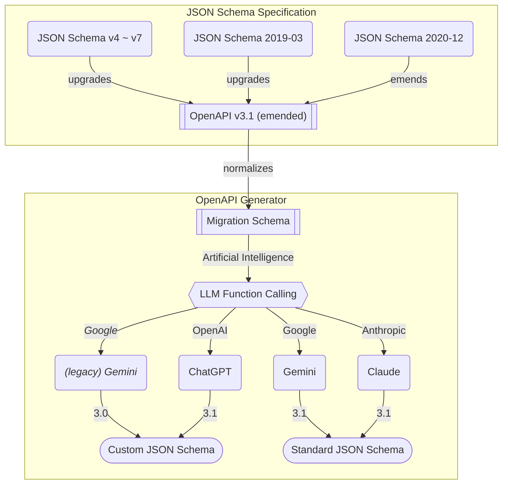

# `@samchon/openapi`


[](https://github.com/samchon/openapi/blob/master/LICENSE)
[](https://www.npmjs.com/package/@samchon/openapi)
[](https://www.npmjs.com/package/@samchon/openapi)
[](https://github.com/samchon/openapi/actions?query=workflow%3Abuild)
[](https://samchon.github.io/openapi/api/)
[](https://discord.gg/E94XhzrUCZ)

Transform OpenAPI documents into type-safe LLM function calling applications.

`@samchon/openapi` converts any version of OpenAPI/Swagger documents into LLM function calling schemas for OpenAI GPT, Claude, and Gemini. It supports every OpenAPI version (Swagger 2.0, OpenAPI 3.0, and OpenAPI 3.1) with full TypeScript type definitions. The library also works with MCP (Model Context Protocol) servers, enabling seamless AI agent development.

**Key Features:**
- **Universal OpenAPI Support**: Works with Swagger 2.0, OpenAPI 3.0, and OpenAPI 3.1
- **LLM Function Calling**: Auto-generates function schemas for OpenAI, Claude, and Gemini
- **Type-Safe Validation**: Built-in validation with detailed error feedback for LLM responses
- **MCP Integration**: Compose function calling schemas from MCP servers
- **Emended Specification**: Standardized OpenAPI v3.1 format that removes ambiguities

**Live Demo:**
> https://github.com/user-attachments/assets/e1faf30b-c703-4451-b68b-2e7a8170bce5
>
> Watch how `@samchon/openapi` powers an AI shopping chatbot with [`@agentica`](https://github.com/wrtnlabs/agentica)
>
> - [View Backend Repository](https://github.com/samchon/shopping-backend)
> - [Explore OpenAPI Document](https://nestia.io/editor/?simulate=true&e2e=true&url=https%3A%2F%2Fraw.githubusercontent.com%2Fsamchon%2Fshopping-backend%2Frefs%2Fheads%2Fmaster%2Fpackages%2Fapi%2Fswagger.json)


## Quick Start

```bash
npm install @samchon/openapi
```

Transform your OpenAPI document into an LLM function calling application in just a few lines:

```typescript
import { HttpLlm, OpenApi } from "@samchon/openapi";

// Load and convert your OpenAPI document
const document: OpenApi.IDocument = OpenApi.convert(swagger);

// Generate LLM function calling schemas
const application: IHttpLlmApplication<"chatgpt"> = HttpLlm.application({
  model: "chatgpt", // "chatgpt" | "claude" | "gemini"
  document,
});

// Find a function by path and method
const func: IHttpLlmFunction<"chatgpt"> | undefined = application.functions.find(
  (f) => f.path === "/bbs/articles" && f.method === "post"
);

// Execute the function with LLM-composed arguments
const result: unknown = await HttpLlm.execute({
  connection: { host: "http://localhost:3000" },
  application,
  function: func,
  arguments: llmGeneratedArgs, // from OpenAI/Claude/Gemini
});
```

That's it! Your HTTP backend is now callable by AI.


## OpenAPI Definitions

`@samchon/openapi` provides complete TypeScript definitions for all OpenAPI versions and introduces an "emended" OpenAPI v3.1 specification that serves as a universal intermediate format.



**Supported Specifications:**
- [Swagger v2.0](https://github.com/samchon/openapi/blob/master/src/SwaggerV2.ts)
- [OpenAPI v3.0](https://github.com/samchon/openapi/blob/master/src/OpenApiV3.ts)
- [OpenAPI v3.1](https://github.com/samchon/openapi/blob/master/src/OpenApiV3_1.ts)
- [**OpenAPI v3.1 (emended)**](https://github.com/samchon/openapi/blob/master/src/OpenApi.ts) - Standardized format

### What is "Emended" OpenAPI?

The emended specification removes ambiguities and duplications from OpenAPI v3.1, creating a cleaner, more consistent format. All conversions flow through this intermediate format. 

**Key Improvements:**
- **Operations**: Merges parameters from path and operation levels, resolves all references
- **JSON Schema**: Eliminates mixed types, unifies nullable handling, standardizes array/tuple representations
- **Schema Composition**: Consolidates `anyOf`, `oneOf`, `allOf` patterns into simpler structures

### Converting Between Versions

```typescript
import { OpenApi } from "@samchon/openapi";

// Convert any version to emended format
const emended: OpenApi.IDocument = OpenApi.convert(swagger); // Swagger 2.0/3.0/3.1

// Downgrade to older versions if needed
const v30: OpenApiV3.IDocument = OpenApi.downgrade(emended, "3.0");
const v20: SwaggerV2.IDocument = OpenApi.downgrade(emended, "2.0");
```

### Validating OpenAPI Documents

Use `typia` for runtime validation with detailed type checking - far more accurate than other validators:

```typescript
import { OpenApi, OpenApiV3, OpenApiV3_1, SwaggerV2 } from "@samchon/openapi";
import typia from "typia";

const document: any = await fetch("swagger.json").then(r => r.json());

// Validate with detailed error messages
const result: typia.IValidation<SwaggerV2.IDocument | OpenApiV3.IDocument | OpenApiV3_1.IDocument> =
  typia.validate<SwaggerV2.IDocument | OpenApiV3.IDocument | OpenApiV3_1.IDocument>(document);

if (result.success) {
  const emended: OpenApi.IDocument = OpenApi.convert(result.data);
} else {
  console.error(result.errors); // Detailed validation errors
}
```

Try it in the playground: [Type assertion](https://typia.io/playground/?script=JYWwDg9gTgLgBAbzgeTAUwHYEEzADQrra4BqAzAapjsOQPoCMBAygO4CGA5p2lCQExwAvnABmUCCDgAiAAIBndiADGACwgYA9BCLtc0gNwAoUJFhwYAT1zsxEqdKs3DRo8o3z4IdsAxwAvHDs8pYYynAAFACUAFxwAAr2wPJoADwAbhDAACYAfAH5CEZwcJqacADiAKIAKnAAmsgAqgBKKPFVAHJY8QCScAAiyADCTQCyXTXFcO4YnnBQaPKQc2hxLUsrKQFBHMDwomgwahHTJdKqMDBg8jFlUOysAHSc+6oArgBG7ylQszCYGBPdwgTSKFTqLQ6TB6YCabyeXiaNAADyUYAANktNOkyE8AAzaXTAJ4AK3kGmk0yixhKs3m2QgyneIEBcXYGEsO0ePngi2WHjQZIpGGixmmZTgNXqHTgWGYzCqLRqvWQnWmTmA7CewV+MAq73YUGyqTOcAAPoRqKQyIwnr0BkyWYCzZaqMRaHiHU7WRgYK64GwuDw+Px7Y7mb7-SVchFGZHATTXCVJcM1SQlXUasg4FUJp0BlUBtN6fA0L7smhsnF3TRwz7ATta7hgRp0rwYHGG36k3SPBAsU9fKIIBFy5hK9kk0JjN5fNFgexjqoIvSB0LeBIoDSgA) | [Detailed validation](https://typia.io/playground/?script=JYWwDg9gTgLgBAbzgeTAUwHYEEzADQrra4BqAzAapjsOQPoCMBAygO4CGA5p2lCQExwAvnABmUCCDgAiAAIBndiADGACwgYA9BCLtc0gNwAoUJFhwYAT1zsxEqdKs3DRo8o3z4IdsAxwAvHDs8pYYynAAFACUAFxwAAr2wPJoADwAbhDAACYAfAH5CEZwcJqacADiAKIAKnAAmsgAqgBKKPFVAHJY8QCScAAiyADCTQCyXTXFcO4YnnBQaPKQc2hxLUsrKQFBHMDwomgwahHTJdKqMDBg8jFlUOysAHSc+6oArgBG7ylQszCYGBPdwgTSKFTqLQ6TB6YCabyeXiaNAADyUYAANktNOkyE8AAzaXTAJ4AK3kGmk0yixhKs3m2QgyneIEBcXYGEsO0ePngi2WHjQZIpGGixmmZTgNXqHTgJCwABlegMsDVeshOtN6Xylu8MfBAk5gOwnul2BicuwAakznAAD6EaikMiMJ7KpkswG2h1UYi0PHu5msjAwb1wNhcHh8fhugYe4Ohkq5CKMoOAmnTYCiSL8vVA+TvZTKJbyAL+QKic0pKKIW30iBYp6+UQQCK5-VPXgSKDyDMlEqLGDvKAYWnCVwlSXDDUkKotOo1ZBwKoTToDKoDLUeeBoYPZNDZOK+mix+OAnbH3DAjTpXgwFNnkN9mYeBtC5ut3eYffZDNCYzeL40TAlaJz1o2XbQDSQA)


## LLM Function Calling


Turn your HTTP backend into an AI-callable service. `@samchon/openapi` converts your OpenAPI document into function schemas that OpenAI, Claude, and Gemini can understand and call.

### Supported AI Models

**[`IChatGptSchema`](https://samchon.github.io/openapi/api/types/IChatGptSchema-1.html)** - For OpenAI GPT
- Fully compatible with OpenAI's strict mode
  - strict mode is not recommended
  - [validation feedback strategy](#validation-feedback---fixing-llm-mistakes) is much powerful
- Uses JSDoc tags in `description` to bypass OpenAI's schema limitations

**[`IClaudeSchema`](https://samchon.github.io/openapi/api/types/IClaudeSchema-1.html)** - For Anthropic Claude ⭐ **Recommended**
- Follows JSON Schema standard most closely
- No artificial restrictions - cleanest type definitions
- Ideal default choice when you're unsure which model to use
  - working on every models unless OpenAI's strict mode or legacy Gemini

**[`IGeminiSchema`](https://samchon.github.io/openapi/api/types/IGeminiSchema-1.html)** - For Google Gemini
- Supports nearly all JSON Schema specifications (as of Nov 2025)
- Previous versions had severe restrictions, but these are now removed

> [!NOTE]
>
> You can also compose [`ILlmApplication`](https://samchon.github.io/openapi/api/interfaces/ILlmApplication-1.html) from a TypeScript class using `typia`.
>
> https://typia.io/docs/llm/application
>
> ```typescript
> import { ILlmApplication } from "@samchon/openapi";
> import typia from "typia";
>
> const app: ILlmApplication<"chatgpt"> =
>   typia.llm.application<YourClassType, "chatgpt">();
> ```

### Complete Example

Here's a full example showing how OpenAI GPT selects a function, fills arguments, and you execute it:

**Resources:**
- [Full Example Code](https://github.com/samchon/openapi/blob/master/test/src/examples/chatgpt-function-call-to-sale-create.ts)
- [User Prompt Example](https://github.com/samchon/openapi/blob/master/test/examples/function-calling/prompts/microsoft-surface-pro-9.md)
- [LLM-Generated Arguments](https://github.com/samchon/openapi/blob/master/test/examples/function-calling/arguments/chatgpt.microsoft-surface-pro-9.input.json)
- [Function Calling Schema](https://github.com/samchon/openapi/blob/master/test/examples/function-calling/schemas/chatgpt.sale.schema.json)

```typescript
import { HttpLlm, OpenApi, IHttpLlmApplication, IHttpLlmFunction } from "@samchon/openapi";
import OpenAI from "openai";

// 1. Convert OpenAPI to LLM function calling application
const document: OpenApi.IDocument = OpenApi.convert(swagger);
const application: IHttpLlmApplication<"chatgpt"> =
  HttpLlm.application({
    model: "chatgpt",
    document,
  });

// 2. Find the function by path and method
const func: IHttpLlmFunction<"chatgpt"> | undefined = application.functions.find(
  (f) => f.path === "/shoppings/sellers/sale" && f.method === "post"
);
if (!func) throw new Error("Function not found");

// 3. Let OpenAI GPT call the function
const client: OpenAI = new OpenAI({ apiKey: process.env.OPENAI_API_KEY });
const completion: OpenAI.ChatCompletion = await client.chat.completions.create({
  model: "gpt-4o",
  messages: [
    { role: "system", content: "You are a helpful shopping assistant." },
    { role: "user", content: "I want to sell Microsoft Surface Pro 9..." }
  ],
  tools: [{
    type: "function",
    function: {
      name: func.name,
      description: func.description,
      parameters: func.parameters,
    }
  }],
});

// 4. Execute the function call on your actual server
const toolCall: OpenAI.ChatCompletionMessageToolCall =
  completion.choices[0].message.tool_calls![0];
const result: unknown = await HttpLlm.execute({
  connection: { host: "http://localhost:37001" },
  application,
  function: func,
  input: JSON.parse(toolCall.function.arguments),
});
```

### Validation Feedback - Fixing LLM Mistakes

**The Problem**: LLMs make type errors. A lot.

Even when your schema says `Array<string>`, GPT might return just `"string"`. In real-world testing with OpenAI GPT-4o-mini on a shopping service:
- **1st attempt**: 70% success rate ❌
- **2nd attempt** (with validation feedback): 98% success rate ✅
- **3rd attempt**: Never failed ✅

**The Solution**: Validate LLM output and send errors back for correction.

```typescript
import { HttpLlm, OpenApi, IHttpLlmApplication, IHttpLlmFunction, IValidation } from "@samchon/openapi";

// Setup application
const document: OpenApi.IDocument = OpenApi.convert(swagger);
const application: IHttpLlmApplication<"chatgpt"> = HttpLlm.application({
  model: "chatgpt",
  document,
});
const func: IHttpLlmFunction<"chatgpt"> = application.functions[0];

// Validate LLM-generated arguments
const result: IValidation<unknown> = func.validate(llmArguments);

if (result.success === false) {
  // Send detailed error feedback to LLM
  return await retryWithFeedback({
    message: "Type errors detected. Please correct the arguments.",
    errors: result.errors, // Detailed error information
  });
} else {
  // Execute the validated function
  const output: unknown = await HttpLlm.execute({
    connection: { host: "http://localhost:3000" },
    application,
    function: func,
    input: result.data,
  });
  return output;
}
```

The validation uses [`typia.validate<T>()`](https://typia.io/docs/validators/validate), which provides the most accurate validation and extremely detailed error messages compared to other validators:

Components               | `typia` | `TypeBox` | `ajv` | `io-ts` | `zod` | `C.V.`
-------------------------|--------|-----------|-------|---------|-------|------------------
**Easy to use**          | ✅ | ❌ | ❌ | ❌ | ❌ | ❌ 
[Object (simple)](https://github.com/samchon/typia/blob/master/test/src/structures/ObjectSimple.ts)          | ✔ | ✔ | ✔ | ✔ | ✔ | ✔
[Object (hierarchical)](https://github.com/samchon/typia/blob/master/test/src/structures/ObjectHierarchical.ts)    | ✔ | ✔ | ✔ | ✔ | ✔ | ✔
[Object (recursive)](https://github.com/samchon/typia/blob/master/test/src/structures/ObjectRecursive.ts)       | ✔ | ❌ | ✔ | ✔ | ✔ | ✔ | ✔
[Object (union, implicit)](https://github.com/samchon/typia/blob/master/test/src/structures/ObjectUnionImplicit.ts) | ✅ | ❌ | ❌ | ❌ | ❌ | ❌
[Object (union, explicit)](https://github.com/samchon/typia/blob/master/test/src/structures/ObjectUnionExplicit.ts) | ✔ | ✔ | ✔ | ✔ | ✔ | ❌
[Object (additional tags)](https://github.com/samchon/typia/#comment-tags)        | ✔ | ✔ | ✔ | ✔ | ✔ | ✔
[Object (template literal types)](https://github.com/samchon/typia/blob/master/test/src/structures/TemplateUnion.ts) | ✔ | ✔ | ✔ | ❌ | ❌ | ❌
[Object (dynamic properties)](https://github.com/samchon/typia/blob/master/test/src/structures/DynamicTemplate.ts) | ✔ | ✔ | ✔ | ❌ | ❌ | ❌
[Array (rest tuple)](https://github.com/samchon/typia/blob/master/test/src/structures/TupleRestAtomic.ts) | ✅ | ❌ | ❌ | ❌ | ❌ | ❌
[Array (hierarchical)](https://github.com/samchon/typia/blob/master/test/src/structures/ArrayHierarchical.ts)     | ✔ | ✔ | ✔ | ✔ | ✔ | ✔
[Array (recursive)](https://github.com/samchon/typia/blob/master/test/src/structures/ArrayRecursive.ts)        | ✔ | ✔ | ✔ | ✔ | ✔ | ❌
[Array (recursive, union)](https://github.com/samchon/typia/blob/master/test/src/structures/ArrayRecursiveUnionExplicit.ts) | ✔ | ✔ | ❌ | ✔ | ✔ | ❌
[Array (R+U, implicit)](https://github.com/samchon/typia/blob/master/test/src/structures/ArrayRecursiveUnionImplicit.ts)    | ✅ | ❌ | ❌ | ❌ | ❌ | ❌
[Array (repeated)](https://github.com/samchon/typia/blob/master/test/src/structures/ArrayRepeatedNullable.ts)    | ✅ | ❌ | ❌ | ❌ | ❌ | ❌
[Array (repeated, union)](https://github.com/samchon/typia/blob/master/test/src/structures/ArrayRepeatedUnionWithTuple.ts)    | ✅ | ❌ | ❌ | ❌ | ❌ | ❌
[**Ultimate Union Type**](https://github.com/samchon/typia/blob/master/test/src/structures/UltimateUnion.ts)  | ✅ | ❌ | ❌ | ❌ | ❌ | ❌

> `C.V.` means `class-validator`


## Model Context Protocol


`@samchon/openapi` provides better MCP function calling than using the [`mcp_servers`](https://openai.github.io/openai-agents-python/mcp/#using-mcp-servers) property directly.

While MCP (Model Context Protocol) can execute server functions directly through the `mcp_servers` property, `@samchon/openapi` offers significant advantages through [model specification support](https://wrtnlabs.io/agentica/docs/core/vendor/), [validation feedback](#validation-feedback), and [selector agent filtering](https://wrtnlabs.io/agentica/docs/concepts/function-calling/#orchestration-strategy) for context optimization.

For example, the GitHub MCP server has 30 functions. Loading all of them via `mcp_servers` creates huge context that often causes AI agents to crash with hallucinations. Function calling with proper filtering avoids this problem.

> https://github.com/user-attachments/assets/72390cb4-d9b1-4d31-a6dd-d866da5a433b
>
> GitHub MCP server via [`mcp_servers`](https://openai.github.io/openai-agents-python/mcp/#using-mcp-servers) often crashes.
>
> However, function calling to GitHub MCP with [`@agentica`](https://github.com/wrtnlabs/agentica) works properly.
>
> - Function calling demo: https://www.youtube.com/watch?v=rLlHkc24cJs

**Creating MCP applications:**

Use [`McpLlm.application()`](https://samchon.github.io/openapi/api/functions/McpLlm.application.html) to create function calling schemas from MCP tools. The returned [`IMcpLlmApplication`](https://samchon.github.io/openapi/api/interfaces/IMcpLlmApplication-1.html) includes the [`IMcpLlmFunction.validate()`](https://samchon.github.io/openapi/api/interfaces/IMcpLlmFunction.html#validate) function for [validation feedback](#validation-feedback).

MCP supports all JSON schema specifications without restrictions:
  - JSON Schema v4, v5, v6, v7
  - JSON Schema 2019-03
  - JSON Schema 2020-12

```typescript
import {
  IMcpLlmApplication,
  IMcpLlmFunction,
  IValidation,
  McpLlm,
} from "@samchon/openapi";

const application: IMcpLlmApplication<"chatgpt"> = McpLlm.application({
  model: "chatgpt",
  tools: [...],
});

const func: IMcpLlmFunction<"chatgpt"> = application.functions.find(
  (f) => f.name === "create",
)!;

const result: IValidation<unknown> = func.validate({
  title: "Hello World",
  body: "Nice to meet you AI developers",
  thumbnail: "https://wrtnlabs.io/agentica/thumbnail.jpg",
});
console.log(result);
```


## Utilization Cases
### Agentica
[](https://github.com/wrtnlabs/agentica)

https://github.com/wrtnlabs/agentica

Agentic AI framework that converts OpenAPI documents into LLM function calling schemas for ChatGPT, Claude, and Gemini. Uses `@samchon/openapi` to transform backend REST APIs into callable functions with automatic parameter validation and type-safe remote execution.

```typescript
import { Agentica, assertHttpController } from "@agentica/core";
import OpenAI from "openai";
import typia from "typia";

import { MobileFileSystem } from "./services/MobileFileSystem";

const agent = new Agentica({
  model: "chatgpt",
  vendor: {
    api: new OpenAI({ apiKey: "********" }),
    model: "gpt-4.1-mini",
  },
  controllers: [
    // functions from TypeScript class
    typia.llm.controller<MobileFileSystem, "chatgpt">(
      "filesystem",
      MobileFileSystem(),
    ),
    // functions from Swagger/OpenAPI
    // Uses @samchon/openapi under the hood:
    // 1. OpenApi.convert() to emended format
    // 2. HttpLlm.application() to create IHttpLlmApplication<"chatgpt">
    // 3. IChatGptSchema composed for each API operation
    assertHttpController({
      name: "shopping",
      model: "chatgpt",
      document: await fetch(
        "https://shopping-be.wrtn.ai/editor/swagger.json",
      ).then(r => r.json()),
      connection: {
        host: "https://shopping-be.wrtn.ai",
        headers: { Authorization: "Bearer ********" },
      },
    }),
  ],
});
await agent.conversate("I wanna buy MacBook Pro");
```

### AutoBE
[](https://autobe.dev)

https://autobe.dev

AI backend code generator achieving 100% compilation success by using function calling to construct compiler AST instead of generating code text. For API specification design, uses `@samchon/openapi` types - AI calls compiler functions to build OpenAPI document structures that define REST endpoints and request/response schemas.

```typescript
import { MicroAgentica } from "@agentica/core";
import { OpenApi } from "@samchon/openapi";

const agent = new MicroAgentica({
  model: "chatgpt",
  vendor: {
    api: new OpenAI({ apiKey: "********" }),
    model: "gpt-4.1-mini",
  },
  controllers: [
    // Compiler functions that receive/produce OpenApi.IDocument
    typia.llm.controller<OpenApiWriteApplication>(
      "api",
      new OpenApiWriteApplication(),
    ),
  ],
});
await agent.conversate("Design API specification, and generate backend app.");

class OpenApiWriteApplication {
  // LLM calls this function with OpenApi.IDocument structure
  // The type guarantees all operations have valid IJsonSchema definitions
  public async write(document: OpenApi.IDocument): Promise<void>  {
    // document.paths contains OpenApi.IOperation[]
    // Each operation.parameters, requestBody, responses use OpenApi.IJsonSchema
    // Compiler validates schema structure before code generation
    ...
  }
}
```