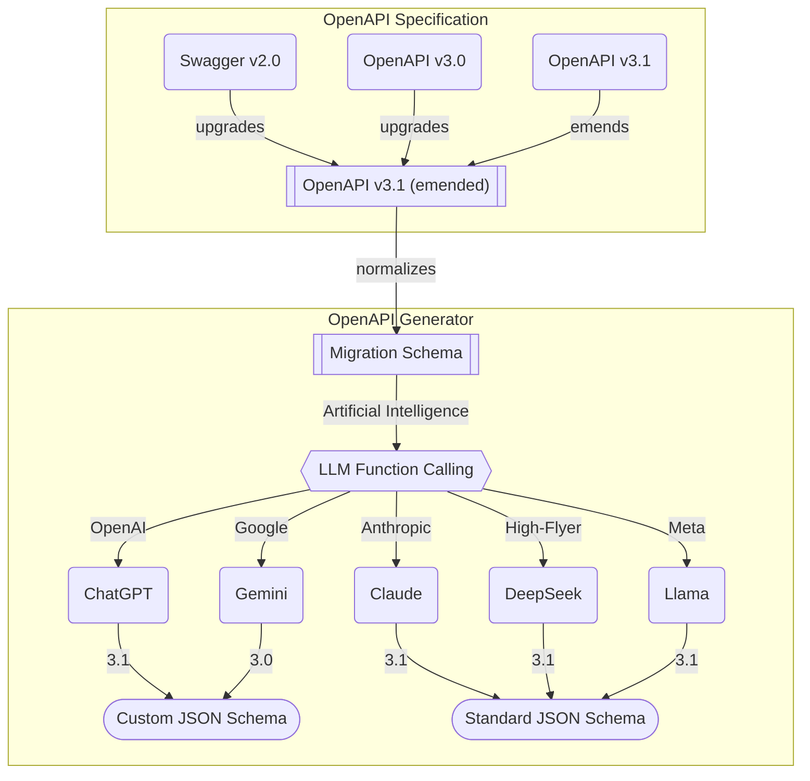
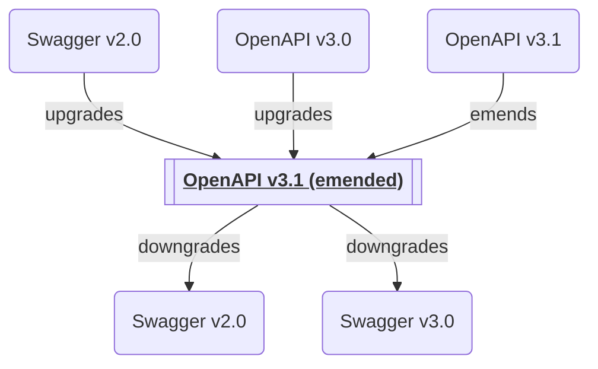
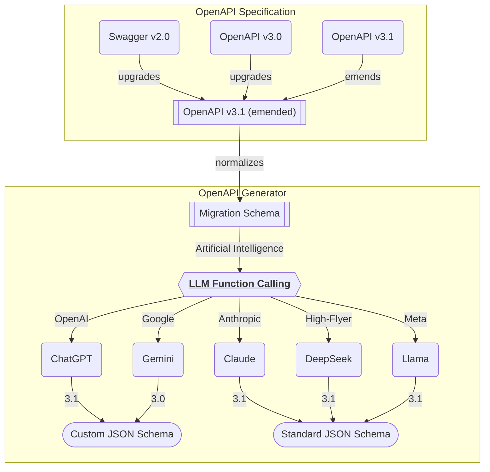
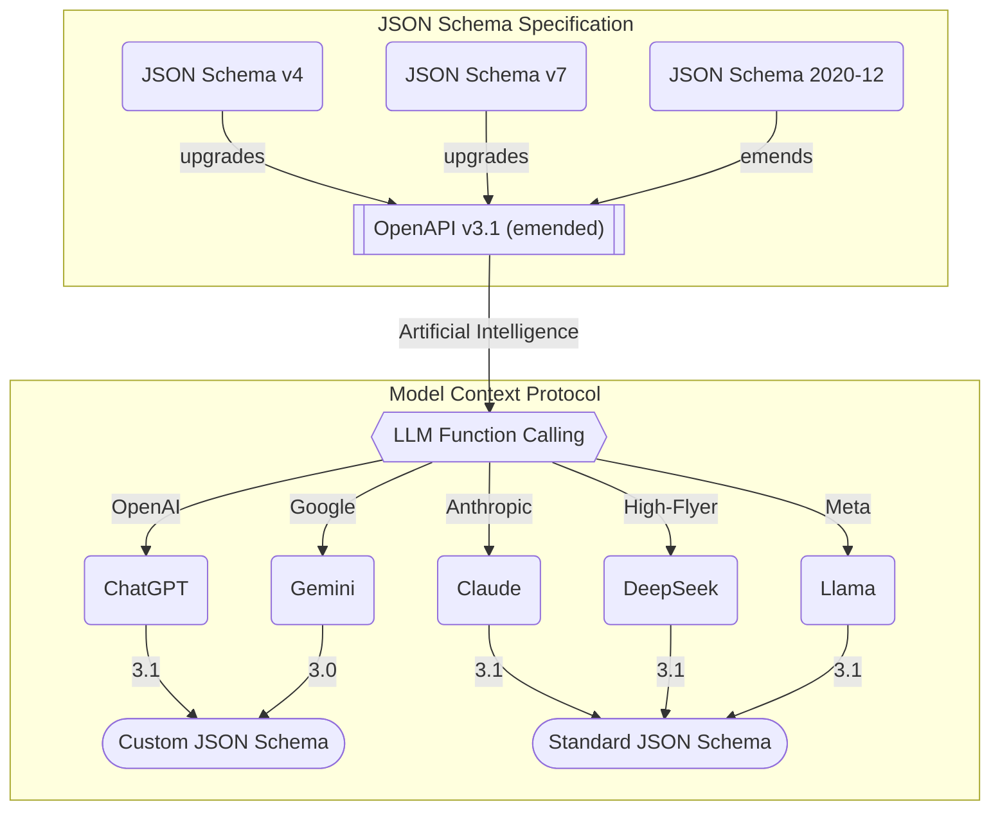

# `@samchon/openapi`


[](https://github.com/samchon/openapi/blob/master/LICENSE)
[](https://www.npmjs.com/package/@samchon/openapi)
[](https://www.npmjs.com/package/@samchon/openapi)
[](https://github.com/samchon/openapi/actions?query=workflow%3Abuild)
[](https://samchon.github.io/openapi/api/)
[](https://discord.gg/E94XhzrUCZ)

OpenAPI definitions, converters and LLM function calling application composer.

`@samchon/openapi` is a collection of OpenAPI types for every versions, and converters for them. In the OpenAPI types, there is an "emended" OpenAPI v3.1 specification, which has removed ambiguous and duplicated expressions for the clarity. Every conversions are based on the emended OpenAPI v3.1 specification.

  1. [Swagger v2.0](https://github.com/samchon/openapi/blob/master/src/SwaggerV2.ts)
  2. [OpenAPI v3.0](https://github.com/samchon/openapi/blob/master/src/OpenApiV3.ts)
  3. [OpenAPI v3.1](https://github.com/samchon/openapi/blob/master/src/OpenApiV3_1.ts)
  4. [**OpenAPI v3.1 emended**](https://github.com/samchon/openapi/blob/master/src/OpenApi.ts)

`@samchon/openapi` also provides LLM (Large Language Model) function calling application composer from the OpenAPI document with many strategies. With the [`HttpLlm`](https://samchon.github.io/openapi/api/modules/HttpLlm.html) module, you can perform the LLM function calling extremely easily just by delivering the OpenAPI (Swagger) document.

  - [`HttpLlm.application()`](https://samchon.github.io/openapi/api/functions/HttpLlm.application.html)
  - [`IHttpLlmApplication<Model>`](https://samchon.github.io/openapi/api/interfaces/IHttpLlmApplication-1.html)
  - [`IHttpLlmFunction<Model>`](https://samchon.github.io/openapi/api/interfaces/IHttpLlmFunction-1.html)
  - Supported schemas
    - [`IChatGptSchema`](https://samchon.github.io/openapi/api/types/IChatGptSchema-1.html): OpenAI ChatGPT
    - [`IClaudeSchema`](https://samchon.github.io/openapi/api/types/IClaudeSchema-1.html): Anthropic Claude
    - [`IDeepSeekSchema`](https://samchon.github.io/openapi/api/types/IDeepSeekSchema-1.html): High-Flyer DeepSeek
    - [`IGeminiSchema`](https://samchon.github.io/openapi/api/types/IGeminiSchema-1.html): Google Gemini
    - [`ILlamaSchema`](https://samchon.github.io/openapi/api/types/ILlamaSchema-1.html): Meta Llama
  - Midldle layer schemas
    - [`ILlmSchemaV3`](https://samchon.github.io/openapi/api/types/ILlmSchemaV3-1.html): middle layer based on OpenAPI v3.0 specification
    - [`ILlmSchemaV3_1`](https://samchon.github.io/openapi/api/types/ILlmSchemaV3_1-1.html): middle layer based on OpenAPI v3.1 specification

Additionally, `@samchon/openapi` supports MCP (Model Context Protocol) function calling. Due to [model specification](https://wrtnlabs.io/agentica/docs/core/vendor/), [validation feedback](https://wrtnlabs.io/agentica/docs/concepts/function-calling/#validation-feedback), and [selector agent](https://wrtnlabs.io/agentica/docs/concepts/function-calling/#orchestration-strategy) reasons, function calling to MCP server is much better than directly using [`mcp_servers`](https://openai.github.io/openai-agents-python/mcp/#using-mcp-servers) property of LLM API.

  - [`McpLlm.application()`](https://samchon.github.io/openapi/api/functions/McpLlm.application.html)
  - [`IMcpLlmApplication`](https://samchon.github.io/openapi/api/interfaces/IMcpLlmApplication-1.html)
  - [`IMcpLlmFunction`](https://samchon.github.io/openapi/api/interfaces/IMcpLlmFunction.html)

> https://github.com/user-attachments/assets/e1faf30b-c703-4451-b68b-2e7a8170bce5
>
> Demonstration video composing A.I. chatbot with `@samchon/openapi` and [`@agentica`](https://github.com/wrtnlabs/agentica)
>
> - Shopping A.I. Chatbot Application: https://nestia.io/chat/shopping
> - Shopping Backend Repository: https://github.com/samchon/shopping-backend
> - Shopping Swagger Document (`@nestia/editor`): [https://nestia.io/editor/?url=...](https://nestia.io/editor/?simulate=true&e2e=true&url=https%3A%2F%2Fraw.githubusercontent.com%2Fsamchon%2Fshopping-backend%2Frefs%2Fheads%2Fmaster%2Fpackages%2Fapi%2Fswagger.json)


## Setup
```bash
npm install @samchon/openapi
```

Just install by `npm i @samchon/openapi` command.

Here is an example code utilizing the `@samchon/openapi` for LLM function calling purpose. 

```typescript
import {
  HttpLlm,
  IChatGptSchema,
  IHttpLlmApplication,
  IHttpLlmFunction,
  OpenApi,
  OpenApiV3,
  OpenApiV3_1,
  SwaggerV2,
} from "@samchon/openapi";
import fs from "fs";
import typia from "typia";

const main = async (): Promise<void> => {
  // read swagger document and validate it
  const swagger:
    | SwaggerV2.IDocument
    | OpenApiV3.IDocument
    | OpenApiV3_1.IDocument = JSON.parse(
    await fs.promises.readFile("swagger.json", "utf8"),
  );
  typia.assert(swagger); // recommended

  // convert to emended OpenAPI document,
  // and compose LLM function calling application
  const document: OpenApi.IDocument = OpenApi.convert(swagger);
  const application: IHttpLlmApplication<"chatgpt"> = HttpLlm.application({
    model: "chatgpt",
    document,
  });

  // Let's imagine that LLM has selected a function to call
  const func: IHttpLlmFunction<"chatgpt"> | undefined = 
    application.functions.find(
      // (f) => f.name === "llm_selected_function_name"
      (f) => f.path === "/bbs/articles" && f.method === "post",
    );
  if (func === undefined) throw new Error("No matched function exists.");

  // actual execution is by yourself
  const article = await HttpLlm.execute({
    connection: {
      host: "http://localhost:3000",
    },
    application,
    function: func,
    arguments: {
      // arguments composed by LLM 
      body: {
        title: "Hello, world!",
        body: "Let's imagine that this argument is composed by LLM.",
        thumbnail: null,
      },
    },
  });
  console.log("article", article);
};
main().catch(console.error);
```


## OpenAPI Definitions


`@samchon/openapi` support every versions of OpenAPI specifications with detailed TypeScript types.

  - [Swagger v2.0](https://github.com/samchon/openapi/blob/master/src/SwaggerV2.ts)
  - [OpenAPI v3.0](https://github.com/samchon/openapi/blob/master/src/OpenApiV3.ts)
  - [OpenAPI v3.1](https://github.com/samchon/openapi/blob/master/src/OpenApiV3_1.ts)
  - [**OpenAPI v3.1 emended**](https://github.com/samchon/openapi/blob/master/src/OpenApi.ts)

Also, `@samchon/openapi` provides "emended OpenAPI v3.1 definition" which has removed ambiguous and duplicated expressions for clarity. It has emended original OpenAPI v3.1 specification like above. You can compose the "emended OpenAPI v3.1 document" by calling the `OpenApi.convert()` function. 

  - Operation
    - Merge `OpenApiV3_1.IPathItem.parameters` to `OpenApi.IOperation.parameters`
    - Resolve references of `OpenApiV3_1.IOperation` members
    - Escape references of `OpenApiV3_1.IComponents.examples`
  - JSON Schema
    - Decompose mixed type: `OpenApiV3_1.IJsonSchema.IMixed`
    - Resolve nullable property: `OpenApiV3_1.IJsonSchema.__ISignificant.nullable`
    - Array type utilizes only single `OpenAPI.IJsonSchema.IArray.items`
    - Tuple type utilizes only `OpenApi.IJsonSchema.ITuple.prefixItems`
    - Merge `OpenApiV3_1.IJsonSchema.IAnyOf` to `OpenApi.IJsonSchema.IOneOf`
    - Merge `OpenApiV3_1.IJsonSchema.IRecursiveReference` to `OpenApi.IJsonSchema.IReference`
    - Merge `OpenApiV3_1.IJsonSchema.IAllOf` to `OpenApi.IJsonSchema.IObject`

Conversions to another version's OpenAPI document is also based on the "emended OpenAPI v3.1 specification" like above diagram. You can do it through `OpenApi.downgrade()` function. Therefore, if you want to convert Swagger v2.0 document to OpenAPI v3.0 document, you have to call two functions; `OpenApi.convert()` and then `OpenApi.downgrade()`.

At last, if you utilize `typia` library with `@samchon/openapi` types, you can validate whether your OpenAPI document is following the standard specification or not. Just visit one of below playground links, and paste your OpenAPI document URL address. This validation strategy would be superior than any other OpenAPI validator libraries.

  - Playground Links
    - [💻 Type assertion](https://typia.io/playground/?script=JYWwDg9gTgLgBAbzgeTAUwHYEEzADQrra4BqAzAapjsOQPoCMBAygO4CGA5p2lCQExwAvnABmUCCDgAiAAIBndiADGACwgYA9BCLtc0gNwAoUJFhwYAT1zsxEqdKs3DRo8o3z4IdsAxwAvHDs8pYYynAAFACUAFxwAAr2wPJoADwAbhDAACYAfAH5CEZwcJqacADiAKIAKnAAmsgAqgBKKPFVAHJY8QCScAAiyADCTQCyXTXFcO4YnnBQaPKQc2hxLUsrKQFBHMDwomgwahHTJdKqMDBg8jFlUOysAHSc+6oArgBG7ylQszCYGBPdwgTSKFTqLQ6TB6YCabyeXiaNAADyUYAANktNOkyE8AAzaXTAJ4AK3kGmk0yixhKs3m2QgyneIEBcXYGEsO0ePngi2WHjQZIpGGixmmZTgNXqHTgWGYzCqLRqvWQnWmTmA7CewV+MAq73YUGyqTOcAAPoRqKQyIwnr0BkyWYCzZaqMRaHiHU7WRgYK64GwuDw+Px7Y7mb7-SVchFGZHATTXCVJcM1SQlXUasg4FUJp0BlUBtN6fA0L7smhsnF3TRwz7ATta7hgRp0rwYHGG36k3SPBAsU9fKIIBFy5hK9kk0JjN5fNFgexjqoIvSB0LeBIoDSgA)
    - [💻 Detailed validation](https://typia.io/playground/?script=JYWwDg9gTgLgBAbzgeTAUwHYEEzADQrra4BqAzAapjsOQPoCMBAygO4CGA5p2lCQExwAvnABmUCCDgAiAAIBndiADGACwgYA9BCLtc0gNwAoUJFhwYAT1zsxEqdKs3DRo8o3z4IdsAxwAvHDs8pYYynAAFACUAFxwAAr2wPJoADwAbhDAACYAfAH5CEZwcJqacADiAKIAKnAAmsgAqgBKKPFVAHJY8QCScAAiyADCTQCyXTXFcO4YnnBQaPKQc2hxLUsrKQFBHMDwomgwahHTJdKqMDBg8jFlUOysAHSc+6oArgBG7ylQszCYGBPdwgTSKFTqLQ6TB6YCabyeXiaNAADyUYAANktNOkyE8AAzaXTAJ4AK3kGmk0yixhKs3m2QgyneIEBcXYGEsO0ePngi2WHjQZIpGGixmmZTgNXqHTgJCwABlegMsDVeshOtN6Xylu8MfBAk5gOwnul2BicuwAakznAAD6EaikMiMJ7KpkswG2h1UYi0PHu5msjAwb1wNhcHh8fhugYe4Ohkq5CKMoOAmnTYCiSL8vVA+TvZTKJbyAL+QKic0pKKIW30iBYp6+UQQCK5-VPXgSKDyDMlEqLGDvKAYWnCVwlSXDDUkKotOo1ZBwKoTToDKoDLUeeBoYPZNDZOK+mix+OAnbH3DAjTpXgwFNnkN9mYeBtC5ut3eYffZDNCYzeL40TAlaJz1o2XbQDSQA)

```typescript
import { OpenApi, OpenApiV3, OpenApiV3_1, SwaggerV2 } from "@samchon/openapi";
import typia from "typia";
 
const main = async (): Promise<void> => {
  // GET YOUR OPENAPI DOCUMENT
  const response: Response = await fetch(
    "https://raw.githubusercontent.com/samchon/openapi/master/examples/v3.0/openai.json"
  );
  const document: any = await response.json();
 
  // TYPE VALIDATION
  const result = typia.validate<
    | OpenApiV3_1.IDocument
    | OpenApiV3.IDocument
    | SwaggerV2.IDocument
  >(document);
  if (result.success === false) {
    console.error(result.errors);
    return;
  }
 
  // CONVERT TO EMENDED
  const emended: OpenApi.IDocument = OpenApi.convert(document);
  console.info(emended);
};
main().catch(console.error);
```


## LLM Function Calling
### Preface


LLM function calling application from OpenAPI document.

`@samchon/openapi` provides LLM (Large Language Model) function calling application from the "emended OpenAPI v3.1 document". Therefore, if you have any HTTP backend server and succeeded to build an OpenAPI document, you can easily make the A.I. chatbot application.

In the A.I. chatbot, LLM will select proper function to remotely call from the conversations with user, and fill arguments of the function automatically. If you actually execute the function call through the [`HttpLlm.execute()`](https://samchon.github.io/openapi/api/functions/HttpLlm.execute.html) function, it is the "LLM function call."

Let's enjoy the fantastic LLM function calling feature very easily with `@samchon/openapi`.

  - Application
    - [`HttpLlm.application()`](https://samchon.github.io/openapi/api/functions/HttpLlm.application.html)
    - [`IHttpLlmApplication`](https://samchon.github.io/openapi/api/interfaces/IHttpLlmApplication-1.html)
    - [`IHttpLlmFunction`](https://samchon.github.io/openapi/api/interfaces/IHttpLlmFunction-1.html)
  - Schemas
    - [`IChatGptSchema`](https://samchon.github.io/openapi/api/types/IChatGptSchema-1.html): OpenAI ChatGPT
    - [`IClaudeSchema`](https://samchon.github.io/openapi/api/types/IClaudeSchema-1.html): Anthropic Claude
    - [`IDeepSeekSchema`](https://samchon.github.io/openapi/api/types/IDeepSeekSchema-1.html): High-Flyer DeepSeek
    - [`IGeminiSchema`](https://samchon.github.io/openapi/api/types/IGeminiSchema-1.html): Google Gemini
    - [`ILlamaSchema`](https://samchon.github.io/openapi/api/types/ILlamaSchema-1.html): Meta Llama
    - [`ILlmSchemaV3`](https://samchon.github.io/openapi/api/types/ILlmSchemaV3-1.html): middle layer based on OpenAPI v3.0 specification
    - [`ILlmSchemaV3_1`](https://samchon.github.io/openapi/api/types/ILlmSchemaV3_1-1.html): middle layer based on OpenAPI v3.1 specification
  - Type Checkers
    - [`ChatGptTypeChecker`](https://github.com/samchon/openapi/blob/master/src/utils/ChatGptTypeChecker.ts)
    - [`ClaudeTypeChecker`](https://github.com/samchon/openapi/blob/master/src/utils/ClaudeTypeChecker.ts)
    - [`GeminiTypeChecker`](https://github.com/samchon/openapi/blob/master/src/utils/GeminiTypeChecker.ts)
    - [`LlamaTypeChecker`](https://github.com/samchon/openapi/blob/master/src/utils/LlamaTypeChecker.ts)
    - [`LlmTypeCheckerV3`](https://github.com/samchon/openapi/blob/master/src/utils/LlmTypeCheckerV3.ts)
    - [`LlmTypeCheckerV3_1`](https://github.com/samchon/openapi/blob/master/src/utils/LlmTypeCheckerV3_1.ts)

> [!NOTE]
>
> You also can compose [`ILlmApplication`](https://samchon.github.io/openapi/api/interfaces/ILlmApplication-1.html) from a class type with `typia`.
>
> https://typia.io/docs/llm/application
>
> ```typescript
> import { ILlmApplication } from "@samchon/openapi";
> import typia from "typia";
>
> const app: ILlmApplication<"chatgpt"> =
>   typia.llm.application<YourClassType, "chatgpt">();
> ```

> [!TIP]
>
> LLM selects proper function and fill arguments.
> 
> In nowadays, most LLM (Large Language Model) like OpenAI are supporting "function calling" feature. The "LLM function calling" means that LLM automatically selects a proper function and fills parameter values from conversation with the user (may by chatting text).
> 
> https://platform.openai.com/docs/guides/function-calling

### Execution
Actual function call execution is by yourself.

LLM (Large Language Model) providers like OpenAI selects a proper function to call from the conversations with users, and fill arguments of it. However, function calling feature supported by LLM providers do not perform the function call execution. The actual execution responsibility is on you.

In `@samchon/openapi`, you can execute the LLM function calling by [`HttpLlm.execute()`](https://samchon.github.io/openapi/api/functions/HttpLlm.execute.html) (or [`HttpLlm.propagate()`](https://samchon.github.io/openapi/api/functions/HttpLlm.propagate.html)) function. Here is an example code executing the LLM function calling through the [`HttpLlm.execute()`](https://samchon.github.io/openapi/api/functions/HttpLlm.execute.html) function. As you can see, to execute the LLM function call, you have to deliver these information:

  - Connection info to the HTTP server
  - Application of the LLM function calling
  - LLM function schema to call
  - Arguments for the function call (maybe composed by LLM)

Here is the example code executing the LLM function call with `@samchon/openapi`.

  - Example Code: [`test/examples/chatgpt-function-call-to-sale-create.ts`](https://github.com/samchon/openapi/blob/master/test/examples/chatgpt-function-call-to-sale-create.ts)
  - Prompt describing the produc to create:  [`Microsoft Surface Pro 9`](https://github.com/samchon/openapi/blob/master/examples/function-calling/prompts/microsoft-surface-pro-9.md)
  - Result of the Function Calling: [`examples/arguments/chatgpt.microsoft-surface-pro-9.input.json`](https://github.com/samchon/openapi/blob/master/examples/function-calling/arguments/chatgpt.microsoft-surface-pro-9.input.json)

```typescript
import {
  HttpLlm,
  IChatGptSchema,
  IHttpLlmApplication,
  IHttpLlmFunction,
  OpenApi,
  OpenApiV3,
  OpenApiV3_1,
  SwaggerV2,
} from "@samchon/openapi";
import OpenAI from "openai";
import typia from "typia";

const main = async (): Promise<void> => {
  // Read swagger document and validate it
  const swagger:
    | SwaggerV2.IDocument
    | OpenApiV3.IDocument
    | OpenApiV3_1.IDocument = JSON.parse(
    await fetch(
      "https://github.com/samchon/shopping-backend/blob/master/packages/api/swagger.json",
    ).then((r) => r.json()),
  );
  typia.assert(swagger); // recommended

  // convert to emended OpenAPI document,
  // and compose LLM function calling application
  const document: OpenApi.IDocument = OpenApi.convert(swagger);
  const application: IHttpLlmApplication<"chatgpt"> = HttpLlm.application({
    model: "chatgpt",
    document,
  });

  // Let's imagine that LLM has selected a function to call
  const func: IHttpLlmFunction<"chatgpt"> | undefined =
    application.functions.find(
      // (f) => f.name === "llm_selected_function_name"
      (f) => f.path === "/shoppings/sellers/sale" && f.method === "post",
    );
  if (func === undefined) throw new Error("No matched function exists.");

  // Get arguments by ChatGPT function calling
  const client: OpenAI = new OpenAI({
    apiKey: "<YOUR_OPENAI_API_KEY>",
  });
  const completion: OpenAI.ChatCompletion =
    await client.chat.completions.create({
      model: "gpt-4o",
      messages: [
        {
          role: "assistant",
          content:
            "You are a helpful customer support assistant. Use the supplied tools to assist the user.",
        },
        {
          role: "user",
          content: "<DESCRIPTION ABOUT THE SALE>",
          // https://github.com/samchon/openapi/blob/master/examples/function-calling/prompts/microsoft-surface-pro-9.md
        },
      ],
      tools: [
        {
          type: "function",
          function: {
            name: func.name,
            description: func.description,
            parameters: func.parameters as Record<string, any>,
          },
        },
      ],
    });
  const toolCall: OpenAI.ChatCompletionMessageToolCall =
    completion.choices[0].message.tool_calls![0];

  // Actual execution by yourself
  const article = await HttpLlm.execute({
    connection: {
      host: "http://localhost:37001",
    },
    application,
    function: func,
    input: JSON.parse(toolCall.function.arguments),
  });
  console.log("article", article);
};
main().catch(console.error);
```

### Validation Feedback
```typescript
import { IHttpLlmFunction, IValidation } from "@samchon/openapi";
import { FunctionCall } from "pseudo";

export const correctFunctionCall = (p: {
  call: FunctionCall;
  functions: Array<IHttpLlmFunction<"chatgpt">>;
  retry: (reason: string, errors?: IValidation.IError[]) => Promise<unknown>;
}): Promise<unknown> => {
  // FIND FUNCTION
  const func: IHttpLlmFunction<"chatgpt"> | undefined =
    p.functions.find((f) => f.name === p.call.name);
  if (func === undefined) {
    // never happened in my experience
    return p.retry(
      "Unable to find the matched function name. Try it again.",
    );
  }

  // VALIDATE
  const result: IValidation<unknown> = func.validate(p.call.arguments);
  if (result.success === false) {
    // 1st trial: 70% (gpt-4o-mini in shopping mall chatbot)
    // 2nd trial with validation feedback: 98%
    // 3rd trial with validation feedback again: never have failed
    return p.retry(
      "Type errors are detected. Correct it through validation errors",
      {
        errors: result.errors,
      },
    );
  }
  return result.data;
}
```

Is LLM Function Calling perfect? No, absolutely not.

LLM (Large Language Model) service vendor like OpenAI takes a lot of type level mistakes when composing the arguments of function calling or structured output. Even though target schema is super simple like `Array<string>` type, LLM often fills it just by a `string` typed value.

In my experience, OpenAI `gpt-4o-mini` (`8b` parameters) is taking about 70% of type level mistakes when filling the arguments of function calling to Shopping Mall service. To overcome the imperfection of such LLM function calling, `@samchon/openapi` supports validation feedback strategy.

The key concept of validation feedback strategy is, let LLM function calling to construct invalid typed arguments first, and informing detailed type errors to the LLM, so that induce LLM to emend the wrong typed arguments at the next turn by using `IHttpLlmFunction<Model>.validate()` function.

Embedded validator function in `IHttpLlmFunction<Model>.validate()` is exactly the same as [`typia.validate<T>()`](https://typia.io/docs/validators/validate) and is more detailed and accurate than other validators. By using this validation feedback strategy, the 70% success rate of the first function calling trial increased to 98% on the second trial and has never failed from the third trial onward.

Components               | `typia` | `TypeBox` | `ajv` | `io-ts` | `zod` | `C.V.`
-------------------------|--------|-----------|-------|---------|-------|------------------
**Easy to use**          | ✅ | ❌ | ❌ | ❌ | ❌ | ❌ 
[Object (simple)](https://github.com/samchon/typia/blob/master/test/src/structures/ObjectSimple.ts)          | ✔ | ✔ | ✔ | ✔ | ✔ | ✔
[Object (hierarchical)](https://github.com/samchon/typia/blob/master/test/src/structures/ObjectHierarchical.ts)    | ✔ | ✔ | ✔ | ✔ | ✔ | ✔
[Object (recursive)](https://github.com/samchon/typia/blob/master/test/src/structures/ObjectRecursive.ts)       | ✔ | ❌ | ✔ | ✔ | ✔ | ✔ | ✔
[Object (union, implicit)](https://github.com/samchon/typia/blob/master/test/src/structures/ObjectUnionImplicit.ts) | ✅ | ❌ | ❌ | ❌ | ❌ | ❌
[Object (union, explicit)](https://github.com/samchon/typia/blob/master/test/src/structures/ObjectUnionExplicit.ts) | ✔ | ✔ | ✔ | ✔ | ✔ | ❌
[Object (additional tags)](https://github.com/samchon/typia/#comment-tags)        | ✔ | ✔ | ✔ | ✔ | ✔ | ✔
[Object (template literal types)](https://github.com/samchon/typia/blob/master/test/src/structures/TemplateUnion.ts) | ✔ | ✔ | ✔ | ❌ | ❌ | ❌
[Object (dynamic properties)](https://github.com/samchon/typia/blob/master/test/src/structures/DynamicTemplate.ts) | ✔ | ✔ | ✔ | ❌ | ❌ | ❌
[Array (rest tuple)](https://github.com/samchon/typia/blob/master/test/src/structures/TupleRestAtomic.ts) | ✅ | ❌ | ❌ | ❌ | ❌ | ❌
[Array (hierarchical)](https://github.com/samchon/typia/blob/master/test/src/structures/ArrayHierarchical.ts)     | ✔ | ✔ | ✔ | ✔ | ✔ | ✔
[Array (recursive)](https://github.com/samchon/typia/blob/master/test/src/structures/ArrayRecursive.ts)        | ✔ | ✔ | ✔ | ✔ | ✔ | ❌
[Array (recursive, union)](https://github.com/samchon/typia/blob/master/test/src/structures/ArrayRecursiveUnionExplicit.ts) | ✔ | ✔ | ❌ | ✔ | ✔ | ❌
[Array (R+U, implicit)](https://github.com/samchon/typia/blob/master/test/src/structures/ArrayRecursiveUnionImplicit.ts)    | ✅ | ❌ | ❌ | ❌ | ❌ | ❌
[Array (repeated)](https://github.com/samchon/typia/blob/master/test/src/structures/ArrayRepeatedNullable.ts)    | ✅ | ❌ | ❌ | ❌ | ❌ | ❌
[Array (repeated, union)](https://github.com/samchon/typia/blob/master/test/src/structures/ArrayRepeatedUnionWithTuple.ts)    | ✅ | ❌ | ❌ | ❌ | ❌ | ❌
[**Ultimate Union Type**](https://github.com/samchon/typia/blob/master/test/src/structures/UltimateUnion.ts)  | ✅ | ❌ | ❌ | ❌ | ❌ | ❌

> `C.V.` means `class-validator`

### Separation
Arguments from both Human and LLM sides.

When composing parameter arguments through the LLM (Large Language Model) function calling, there can be a case that some parameters (or nested properties) must be composed not by LLM, but by Human. File uploading feature, or sensitive information like secret key (password) cases are the representative examples.

In that case, you can configure the LLM function calling schemas to exclude such Human side parameters (or nested properties) by `IHttpLlmApplication.options.separate` property. Instead, you have to merge both Human and LLM composed parameters into one by calling the [`HttpLlm.mergeParameters()`](https://samchon.github.io/openapi/api/functions/HttpLlm.mergeParameters.html) before the LLM function call execution of [`HttpLlm.execute()`](https://samchon.github.io/openapi/api/functions/HttpLlm.execute.html) function.

Here is the example code separating the file uploading feature from the LLM function calling schema, and combining both Human and LLM composed parameters into one before the LLM function call execution.

  - Example Code: [`test/examples/claude-function-call-separate-to-sale-create.ts`](https://github.com/samchon/openapi/blob/master/test/examples/claude-function-call-separate-to-sale-create.ts.ts)
  - Prompt describing the produc to create:  [`Microsoft Surpace Pro 9`](https://github.com/samchon/openapi/blob/master/examples/function-calling/prompts/microsoft-surface-pro-9.md)
  - Result of the Function Calling: [`examples/arguments/claude.microsoft-surface-pro-9.input.json`](https://github.com/samchon/openapi/blob/master/examples/function-calling/arguments/claude.microsoft-surface-pro-9.input.json)

```typescript
import Anthropic from "@anthropic-ai/sdk";
import {
  ClaudeTypeChecker,
  HttpLlm,
  IClaudeSchema,
  IHttpLlmApplication,
  IHttpLlmFunction,
  OpenApi,
  OpenApiV3,
  OpenApiV3_1,
  SwaggerV2,
} from "@samchon/openapi";
import typia from "typia";

const main = async (): Promise<void> => {
  // Read swagger document and validate it
  const swagger:
    | SwaggerV2.IDocument
    | OpenApiV3.IDocument
    | OpenApiV3_1.IDocument = JSON.parse(
    await fetch(
      "https://github.com/samchon/shopping-backend/blob/master/packages/api/swagger.json",
    ).then((r) => r.json()),
  );
  typia.assert(swagger); // recommended

  // convert to emended OpenAPI document,
  // and compose LLM function calling application
  const document: OpenApi.IDocument = OpenApi.convert(swagger);
  const application: IHttpLlmApplication<"claude"> = HttpLlm.application({
    model: "claude",
    document,
    options: {
      reference: true,
      separate: (schema) =>
        ClaudeTypeChecker.isString(schema) &&
        !!schema.contentMediaType?.startsWith("image"),
    },
  });

  // Let's imagine that LLM has selected a function to call
  const func: IHttpLlmFunction<"claude"> | undefined =
    application.functions.find(
      // (f) => f.name === "llm_selected_function_name"
      (f) => f.path === "/shoppings/sellers/sale" && f.method === "post",
    );
  if (func === undefined) throw new Error("No matched function exists.");

  // Get arguments by ChatGPT function calling
  const client: Anthropic = new Anthropic({
    apiKey: "<YOUR_ANTHROPIC_API_KEY>",
  });
  const completion: Anthropic.Message = await client.messages.create({
    model: "claude-3-5-sonnet-latest",
    max_tokens: 8_192,
    messages: [
      {
        role: "assistant",
        content:
          "You are a helpful customer support assistant. Use the supplied tools to assist the user.",
      },
      {
        role: "user",
        content: "<DESCRIPTION ABOUT THE SALE>",
        // https://github.com/samchon/openapi/blob/master/examples/function-calling/prompts/microsoft-surface-pro-9.md
      },
    ],
    tools: [
      {
        name: func.name,
        description: func.description,
        input_schema: func.separated!.llm as any,
      },
    ],
  });
  const toolCall: Anthropic.ToolUseBlock = completion.content.filter(
    (c) => c.type === "tool_use",
  )[0]!;

  // Actual execution by yourself
  const article = await HttpLlm.execute({
    connection: {
      host: "http://localhost:37001",
    },
    application,
    function: func,
    input: HttpLlm.mergeParameters({
      function: func,
      llm: toolCall.input as any,
      human: {
        // Human composed parameter values
        content: {
          files: [],
          thumbnails: [
            {
              name: "thumbnail",
              extension: "jpeg",
              url: "https://serpapi.com/searches/673d3a37e45f3316ecd8ab3e/images/1be25e6e2b1fb7509f1af89c326cb41749301b94375eb5680b9bddcdf88fabcb.jpeg",
            },
            // ...
          ],
        },
      },
    }),
  });
  console.log("article", article);
};
main().catch(console.error);
```


## Model Context Protocol


LLM function calling schema from MCP document.

As MCP (Model Context Protocol) contains function caller itself, it is possible to execute MCP server's functions without any extra dedication just by using [`mcp_servers`](https://openai.github.io/openai-agents-python/mcp/#using-mcp-servers) property of LLM API. However, due to [JSON schema model specification](https://wrtnlabs.io/agentica/docs/core/vendor/), [validation feedback](https://wrtnlabs.io/agentica/docs/concepts/function-calling/#validation-feedback) and [selector agent](https://wrtnlabs.io/agentica/docs/concepts/function-calling/#orchestration-strategy)'s filtering for context reducing, `@samchon/openapi` recommends to use function calling instead of using the [`mcp_servers`](https://openai.github.io/openai-agents-python/mcp/#using-mcp-servers).

For example, if you bring a GitHub MCP server to Claude Desktop and request it to do something, you will often see the AI ​​agent crash immediately. This is because there are 30 functions in the GitHub MCP server, and if you put them all by using [`mcp_servers`](https://openai.github.io/openai-agents-python/mcp/#using-mcp-servers), the context will be huge and hallucination will occur.

> https://github.com/user-attachments/assets/72390cb4-d9b1-4d31-a6dd-d866da5a433b
>
> GitHub MCP server to [`mcp_servers`](https://openai.github.io/openai-agents-python/mcp/#using-mcp-servers) often breaks down AI agent.
>
> However, if call the function of GitHub MCP server by function calling with [`@agentica`](https://github.com/wrtnlabs/agentica), it works properly without any problem.
> 
> - Function calling to GitHub MCP: https://www.youtube.com/watch?v=rLlHkc24cJs
To make function calling schemas, call [`McpLlm.application()`](#validation-feedback) function. [`IMcpLlmApplication`](https://samchon.github.io/openapi/api/interfaces/IMcpLlmApplication-1.html) typed application instance would be returned, and it will contain the [`IMcpLlmFunction.validate()`](https://samchon.github.io/openapi/api/interfaces/IMcpLlmFunction.html#validate) function utilized for the [validation feedback](#validation-feedback) strategy.

Don't worry about the JSON schema specification. As MCP (Model Context Protocol) does not restrict any JSON schema specification, the [`McpLlm.application()`](#validation-feedback) function has been designed to support every JSON schema specifications.

  - JSON Schema v4, v5, v6, v7
  - JSON Schema 2019-03
  - JSON Schema 2020-12

```typescript
import {
  IMcpApplication,
  IMcpFunction,
  IValidation,
  McpLlm,
} from "@samchon/openapi";

const application: IMcpLlmApplication<"chatgpt"> = McpLlm.application({
  model: "chatgpt",
  tools: [...],
});
const func: IMcpLlmFunction<"chatgpt"> = application.functions.find(
  (f) => f.name === "create",
);
const result: IValidation<unknown> = func.validate({
  title: "Hello World",
  body: "Nice to meet you AI developers",
  thumbnail: "https://wrtnlabs.io/agentica/thumbnail.jpg",
});
console.log(result);
```


## Agentica


https://github.com/wrtnlabs/agentica

`agentica` is the simplest **Agentic AI** library, specialized in **LLM Function Calling** with `@samchon/openapi`.

With it, you don't need to compose a complex agent graph or workflow. Instead, just deliver **Swagger/OpenAPI/MCP** documents or **TypeScript class** types linearly to the `agentica`. Then `agentica` will do everything with the function calling.
Look at the below demonstration, and feel how `agentica` is easy and powerful combining with `@samchon/openapi`.

```typescript
import { Agentica } from "@agentica/core";
import typia from "typia";

const agent = new Agentica({
  controllers: [
    await fetch(
      "https://shopping-be.wrtn.ai/editor/swagger.json",
    ).then(r => r.json()),
    typia.llm.application<ShoppingCounselor>(),
    typia.llm.application<ShoppingPolicy>(),
    typia.llm.application<ShoppingSearchRag>(),
  ],
});
await agent.conversate("I wanna buy MacBook Pro");
```
